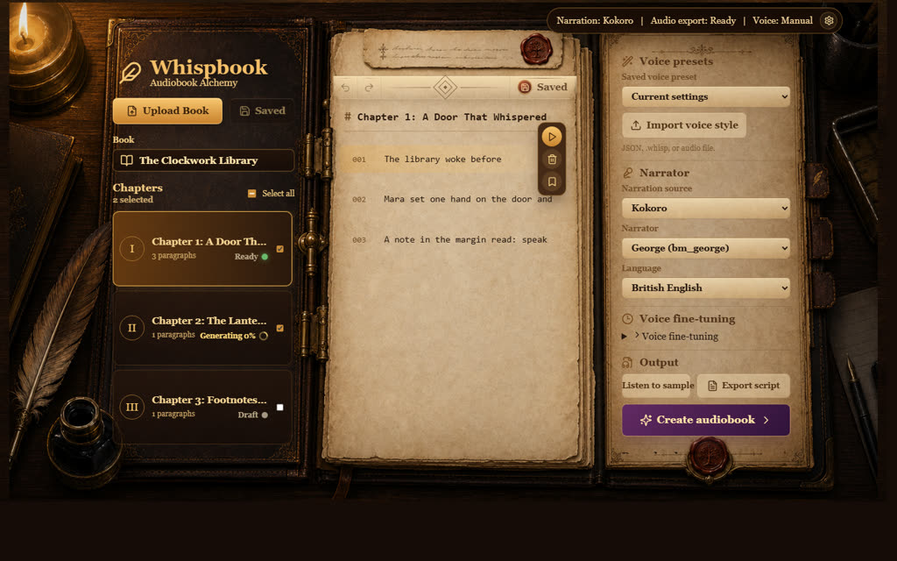

# Whispbook

[](https://github.com/chakib-belgaid/whispbook/actions/workflows/frontend-tests.yml)
[](https://github.com/chakib-belgaid/whispbook/actions/workflows/backend-tests.yml)
[](https://github.com/chakib-belgaid/whispbook/actions/workflows/release.yml)
[](LICENSE)

Whispbook is a self-hosted audiobook studio for readers, writers, and audiobook tinkerers who want to turn selectable-text documents into chaptered audio with subtitles. It combines a React writing desk, a FastAPI backend, local document conversion, and local/open-source TTS engines so you can import a manuscript, clean up the text, preview voices, generate chapters, and export a finished audiobook package.



## Features

- Import local documents and split them into chapters and paragraphs.
- Review, edit, exclude, and mark paragraphs before generation.
- Select which chapters should be included in the audiobook job.
- Preview a single paragraph before rendering a full book.
- Use Kokoro, Chatterbox, Chatterbox Turbo, or a local mock TTS engine.
- Import custom narration styles from JSON and optional reference audio.
- Use Chatterbox Turbo character casts, highlighted voice ranges, and inline paralinguistic tags such as `[laugh]` or `[breath]`.
- Export a Python generation script that snapshots current book edits and TTS settings.
- Generate per-chapter `.m4a` files with `.vtt` and `.srt` subtitles.
- Build a final `.m4b` audiobook with chapter metadata, embedded `mov_text` subtitles, and sidecar subtitle files.

## Architecture

The frontend is a Vite + React application in `src/`. It talks to the backend through `/api` and `/media`; during local development, `vite.config.ts` proxies those paths to `http://127.0.0.1:8000` unless `WHISPBOOK_API_URL` is set.

The backend is a FastAPI application in `backend/app/`. It stores imported books, custom styles, previews, jobs, generated audio, and subtitle files under `storage/` by default. The backend uses MarkItDown for document conversion, ffmpeg/ffprobe for audio processing and packaging, and TTS providers from the Python environment.

## Requirements

- Node.js 20 or newer.
- npm 10.8.2 or compatible; the project declares `packageManager: npm@10.8.2`.
- Python 3.10 through 3.13. Python 3.11+ is recommended.
- `uv` for backend dependency management.
- `ffmpeg` and `ffprobe`.
- `espeak-ng` for Kokoro voices.
- Enough disk space for Hugging Face model downloads.

## Local Development

Install frontend dependencies from the repository root:

```bash
npm install
```

Create and run the backend from another terminal:

```bash
cd backend
uv sync
uv run uvicorn app.main:app --host 0.0.0.0 --port 8000
```

Run the frontend:

```bash
npm run dev
```

Open `http://localhost:5173`.

## Docker

Docker Compose starts both services and stores backend data in the repository's `storage/` directory:

```bash
docker compose up --build
```

The frontend runs on `http://localhost:5173` and the API runs on `http://localhost:8000`.

## Configuration

| Variable                    | Used by                | Purpose                                                                                                                        |
| --------------------------- | ---------------------- | ------------------------------------------------------------------------------------------------------------------------------ |
| `WHISPBOOK_API_URL`         | Frontend dev server    | Overrides the Vite proxy target for `/api` and `/media`.                                                                       |
| `WHISPBOOK_STORAGE`         | Backend                | Sets the storage root for books, styles, previews, jobs, and generated media. Defaults to the repository `storage/` directory. |
| `HF_HOME`                   | Hugging Face libraries | Moves the Hugging Face model cache away from the default `~/.cache/huggingface`.                                               |
| `HF_TOKEN`                  | Hugging Face libraries | Authenticates model downloads when needed.                                                                                     |
| `WHISPBOOK_ENABLE_MOCK_TTS` | Backend                | Enables the mock sine-wave TTS engine for local smoke tests when set to `1`.                                                   |

Whispbook does not currently wire a separate model-based annotation provider. Subtitle text and exported generation scripts use the imported and edited book state from the app.

## Model Downloads

Whispbook loads Kokoro, Chatterbox, and Chatterbox Turbo weights from Hugging Face. Missing files download lazily on the first preview or generation, but you can warm the cache ahead of time:

```bash
cd backend
uv sync

uv run python - <<'PY'
from huggingface_hub import snapshot_download
import os

downloads = [
    (
        "Kokoro",
        "hexgrad/Kokoro-82M",
        ["config.json", "kokoro-v1_0.pth", "voices/*.pt"],
    ),
    (
        "Chatterbox",
        "ResembleAI/chatterbox",
        [
            "ve.safetensors",
            "t3_cfg.safetensors",
            "s3gen.safetensors",
            "tokenizer.json",
            "conds.pt",
        ],
    ),
    (
        "Chatterbox Turbo",
        "ResembleAI/chatterbox-turbo",
        ["*.safetensors", "*.json", "*.txt", "*.pt", "*.model"],
    ),
]

for label, repo_id, allow_patterns in downloads:
    path = snapshot_download(
        repo_id=repo_id,
        allow_patterns=allow_patterns,
        token=os.getenv("HF_TOKEN") or None,
    )
    print(f"{label}: {path}")
PY
```

Set `HF_HOME=/path/to/cache` before running the command if you want a custom cache location.

## Document Import

Whispbook uses Microsoft MarkItDown to convert uploaded local documents into Markdown before chapter and paragraph extraction. Supported imports are PDF, DOCX, PPTX, XLS, XLSX, EPUB, HTML, TXT, Markdown, CSV, JSON, and XML.

Imports are local uploads only. URL import, ZIP import, audio/video transcription, image OCR, Azure Document Intelligence, and MarkItDown plugins are not enabled. Scanned PDFs or image-only documents need selectable text unless MarkItDown can extract useful text without OCR.

## Audiobook Workflow

1. Start the backend and frontend.
2. Import one or more supported documents from the left book panel.
3. Select the active book and review the detected chapters.
4. Edit paragraph text, exclude paragraphs that should not be spoken, and select the chapters to include.
5. Choose a narration source, voice, language, pacing, and advanced style settings.
6. For Chatterbox Turbo, import character voices, assign selected paragraph text to cast members, and insert paralinguistic tags from the paragraph inspector.
7. Use **Listen to sample** to preview the selected paragraph.
8. Use **Create audiobook** to start background generation.
9. Use **Listen while creating** to play ready paragraph audio while the rest of the book keeps synthesizing.
10. Download chapter audio, subtitles, and the final audiobook package from the render panel.

## Custom Styles

Custom style JSON can include engine parameters:

```json
{
  "description": "Slow dramatic narration",
  "voice": "af_heart",
  "language": "en",
  "speed": 0.95,
  "exaggeration": 0.7,
  "cfg_weight": 0.35,
  "temperature": 0.85,
  "top_p": 0.95,
  "paragraph_gap_ms": 650,
  "comma_pause_ms": 180
}
```

For Chatterbox styles, upload a 5-10 second reference clip when you want the style to follow a known external voice or narration sample.

Chatterbox Turbo also supports book-local character casts. Cast entries point to saved Turbo styles, while paragraph voice assignments are stored as highlighted text ranges. Paralinguistic tags stay inline in the paragraph text for TTS guidance, and generated subtitles omit those tags.

## Exported Generation Scripts

Use **Export script** in the Audiobook panel to download a Python script for the current voice settings. The script includes:

- Current book edits and paragraph inclusion flags.
- Selected chapter IDs.
- TTS engine, voice, language, and generation parameters.

Run it while the backend is up:

```bash
python whispbook-your-book-*.py
```

Pass `--detach` to start the backend job and exit without polling, `--skip-save` to use the backend's current book state without patching exported edits, or `--api-url http://host:8000` when the backend is not on the exported default URL.

## Troubleshooting

- `ffmpeg and ffprobe are required.`: install ffmpeg and make sure both `ffmpeg` and `ffprobe` are on `PATH`.
- `Kokoro is not installed.`: run `uv sync --project backend`; install `espeak-ng` on the host.
- `Chatterbox needs torch and torchaudio.`: run `uv sync --project backend` with Python 3.10 or newer.
- `Chatterbox's PerTh dependency needs pkg_resources.`: run `uv sync --project backend` so the compatible setuptools dependency is present.
- `MarkItDown is required to import documents.`: run `uv sync --project backend`.
- `No text content found.`: upload a selectable-text document; OCR is not included in this version.
- Frontend API requests fail in development: confirm the backend is running on `http://127.0.0.1:8000` or set `WHISPBOOK_API_URL` before running `npm run dev`.

## CI/CD

Pull requests and pushes to `master` or `main` run separate workflows:

- **Frontend Tests** checks formatting, lints the frontend, runs Vitest, and builds the Vite app.
- **Backend Tests** runs Ruff and the pytest suite through `uv`.

Release validation is separate from PR checks. It runs only for manual dispatches or version tags (`v*`) and adds a backend Docker image build on top of the normal frontend and backend validation.

Run the same checks locally before publishing changes:

```bash
npm run format:check
npm run lint
npm test
npm run build
uv run --project backend --frozen ruff check backend/app backend/tests
uv run --project backend --frozen pytest backend/tests
```

## License

Whispbook is released under the [MIT License](LICENSE).
